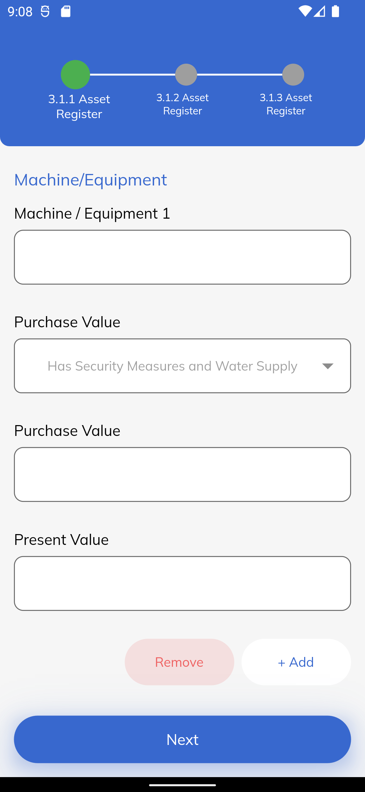

# flutter_linear_timeline
A new Flutter package to generate linear timeline with dynamic length.

Size size = MediaQuery.of(context).size;

LinearLineWidget(
width: size.width * 0.7,
lineList: profileLineList,
currentIndex: index,
)

